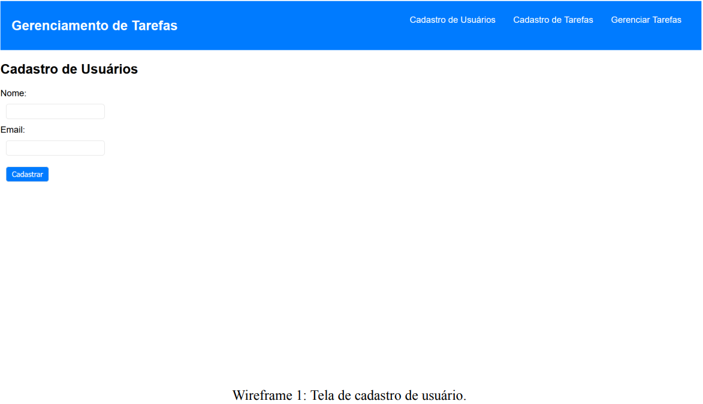
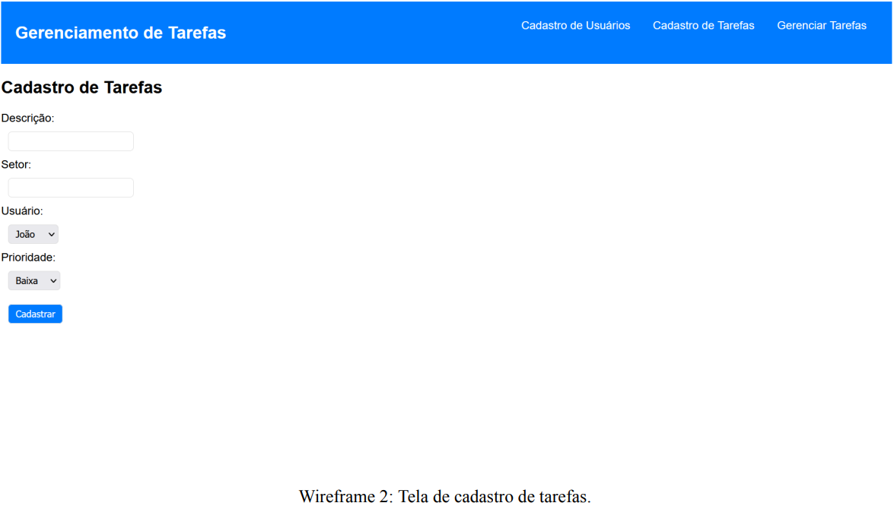
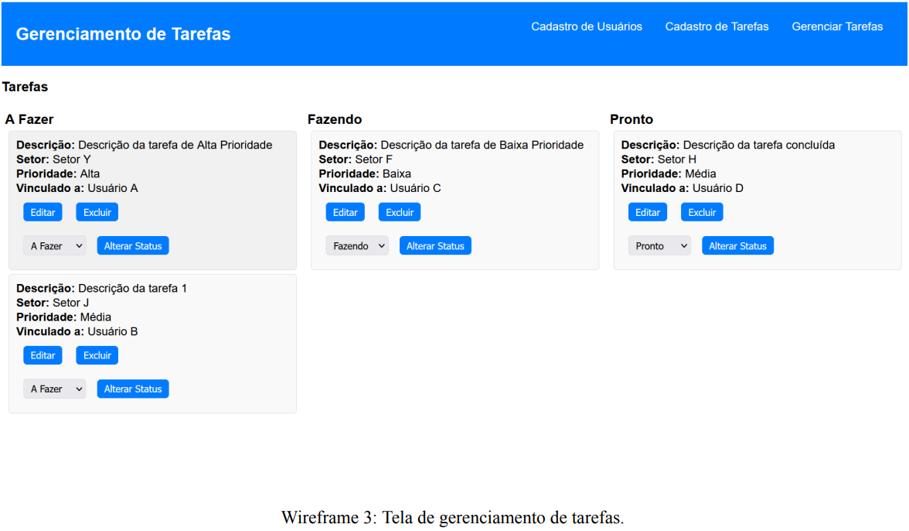

# To do (tarefas)
Sistema simples de gerenciamento de tarefas e status com as funcionalidades CRUD básicas

## Situação de aprendizagem desafiadora

## Contextualização
Uma indústria, do ramo alimentício, gerencia tarefas de seus setores utilizando o kanban. Não foi realizado um mapeamento do fluxo de cada setor, apenas é feito o controle das tarefas em modelo simplificado como o to do list, onde as etapas são divididas em: a fazer, fazendo e pronto. O kanban foi utilizado por compartilhar as informações de forma visual, aumentando a transparência e permitindo que toda equipe do setor fique ciente das tarefas. Porém, a necessidade da empresa é aumentar a visibilidade das tarefas e integrar as informações entre todos os setores.

## Desafio
Fazendo o uso dos seus conhecimentos, utilize as linguagens que aprendeu durante o curso para criar uma aplicação que faça o gerenciamento de tarefas no formato to do list. Os dados do usuário que a empresa deseja armazenar são: id, nome, e-mail. Em relação às tarefas a empresa deseja que sejam armazenados os seguintes dados: id da tarefa, id do usuário, descrição da tarefa, nome do setor, prioridade (baixa, média e alta), data de cadastro e status (a fazer, fazendo e pronto) que por padrão será
inserido como a fazer. 
Um usuário pode cadastrar uma ou mais tarefas, porém uma tarefa é cadastrada por somente um usuário. O gerenciamento da tarefa deve funcionar da seguinte forma: após o usuário cadastrar a tarefa, ele poderá gerenciar a mesma, selecionando-a e alterando seu status, prioridade, ou os dois, atualizando a tarefa. 
A apresentação das tarefas será feita em uma tabela com três colunas representando cada status. Para garantir a integridade das informações todos os campos de cadastro deverão ser de inserção obrigatória. Não é necessário a implementação do controle de acesso do usuário (login, sessão, níveis). Abaixo você verá detalhadamente as entregas que deverão ser efetuadas e quais requisitos elas deverão cumprir.

## Entrefas
|N°|Nome da entrega|Descrição da entrega|
|-|-|-|
|1|Diagrama entidade relacionamento. (Tempo estimado: 10 minutos)|Criação de um diagrama entidade-relacionamento modelo lógico do banco de dados que represente o cenário proposto acima com base na regra de negócio e o diagrama conceito elaborado previamente.|
|2|Criação do banco de dados. (Tempo estimado: 20 minutos)|Criação do banco com base no diagrama conceito e regra de negócio apresentada no desafio e exportação do script de criação ou backup da base de dados.|
|3|Caso de uso do cenário de gerenciamento de tarefas. (Tempo estimado: 20 minutos)|Criação de um diagrama de caso de uso que ilustre o cenário do sistema de gerenciamento de tarefas.|
|4|Tela de cadastro de usuários. (Tempo estimado: 30 minutos)|Criação de uma tela para cadastro de novos usuários no sistema, onde a mesma realize a persistência dos dados na base de dados.|
|5|Tela de cadastro de tarefas. (Tempo estimado: 40 minutos)|Criação de uma tela para cadastrar novas  tarefas, associando-as a um usuário, onde a mesma realize a persistência dos dados na base de dados.|
|6|Tela de gerenciamento de tarefas. (Tempo estimado: 60 minutos)|Criação de uma tela de gerenciamento de  tarefas com funcionalidades para visualizar, editar, excluir e atualizar registros do banco de dados.|

### 1. Diagrama Entidade-Relacionamento (DER)
Você deve criar um diagrama entidade-relacionamento que contenha as tabelas, relações, campos e chaves do banco de dados previstos por você para atendimento ao cenário proposto acima. Ao criar seu diagrama, leve também em consideração o diagrama de entidade-relacionamento conceito que foi fornecido pelo avaliador.  Todos os atributos e relacionamentos estão contidos na regra de negócio apresentada no desafio e no diagrama conceito.  O diagrama criado deve ser exportado em formato *.png (ou qualquer outro formato digital previamente
acordado com o avaliador) e entregue para avaliação posterior.

### 2. Criação do Banco de Dados
Para essa entrega você deve criar toda a estrutura física de banco de dados com suas respectivas tabelas, relacionamentos e consultas/views necessários para atender a proposta do cenário acima. O banco de dados criado deve considerar a estrutura projetada no diagrama entidade- relacionamento construído por você, onde todos os campos deverão ser de inserção obrigatória. O banco de dados criado deve ter sua estrutura e dados exportados para um arquivo em formato *.SQL (ou qualquer outro formato digital previamente acordado com o avaliador) e entregue para avaliação posterior.

### 3. Caso de uso do cenário de gerenciamento de tarefas
Diante do cenário apresentado, você deve criar um caso de uso que ilustre os atores, objetos e ações envolvidos no fluxo de gerenciamento de tarefas de um setor. Para isso, você deve também levar em consideração as regras de negócio detalhadas no desafio e nas próximas seções desse documento. Seu diagrama de caso de uso deve ser exportado em formato *.png (ou qualquer outro formato digital previamente acordado com o avaliador) e entregue para avaliação posterior
### 4. Tela cadastro de usuários
Para atender ao cenário apresentado, você deve criar a interface (tela) de cadastro dos usuários. Os campos de inserção devem seguir a regra de negócio apresentada no desafio e a estrutura do banco de dados criado. Essa interface deverá ser acessada pelo menu principal. Para garantir a integridade das informações o formulário só poderá ser submetido se todos os campos forem preenchidos. O campo email deverá possuir validação para saber se o e-mail digitado é válido, e assim que o registro do cadastro for efetuado, deverá apresentar uma mensagem de aviso com a mensagem "cadastro concluído com sucesso". Após a apresentação da mensagem você deverá garantir que os dados foram inseridos na base de dados. A imagem (Wireframe 1) ilustra um exemplo de como essa tela pode ser implementada:  Atente que essa imagem (wireframe 1) é uma representação simples da tela, onde foi utilizado um estilo CSS simplificado. Você poderá construir um estilo CSS similar desde que não afete a funcionalidade. Sinta-se livre para criar seu próprio layout, contanto que as funcionalidades sejam preservadas.
### 5. Tela de cadastro de tarefas
Nesse tópico você deve criar uma interface (tela) de cadastro de tarefas. Os campos de inserção devem seguir a regra de negócio apresentada no desafio e a estrutura do banco de dados criado. Nessa interface de cadastro de tarefas, o campo usuário deve ser recuperado da base de dados previamente cadastrado seguindo a regra de negócio apresentada no desafio. O campo prioridade deverá apresentar as opções baixa, média e alta, além disso, essa interface deverá ser acessada pelo menu principal. Para garantir a integridade das informações o formulário só poderá ser submetido se todos os campos forem preenchidos. Assim que o registro do cadastro for efetuado, deverá apresentar uma mensagem de aviso "cadastro concluído com sucesso". Após a apresentação da mensagem você deverá garantir que os dados foram inseridos na base de dados. A imagem (wireframe 2) a seguir ilustra um exemplo de como essa tela pode ser implementada:  Atente que essa imagem (wireframe 2) é uma representação simples da tela, onde foi utilizado um estilo CSS simplificado. Você poderá construir um estilo CSS similar desde que não afete a funcionalidade. Sinta-se livre para criar seu próprio layout, contanto que as funcionalidades sejam preservadas.
### 6. Tela de gerenciamento de tarefas
Nesse tópico você deve criar uma interface (tela) de gerenciamento de tarefas. Ela não possui campos de inserção, apenas de atualização, seja para edição ou exclusão da tarefa. Esse processo deve seguir as regras de negócio apresentadas no desafio. Nessa interface de gerenciamento de tarefas, o campo status da tarefa deve ser recuperado da base de dados previamente cadastrado seguindo a regra de negócio apresentada no desafio. Além disso, essa deverá ser a primeira tela apresentada quando iniciada a aplicação. Essa interface deverá ser acessada pelo menu principal. Além disso, a apresentação das tarefas na interface deve ser organizada em três colunas, cada uma representando cada status, a fazer, fazendo e pronto. As tarefas que a interface listar em tela devem estar cadastradas previamente no banco de dados e elas devem ser apresentadas nas respectivas colunas de seu status. Todas as tarefas devem apresentar os dados relatados na regra de negócio, são eles: descrição da tarefa, setor, prioridade, usuário vinculado, status. Ao clicar no botão editar tarefa, deverá ser direcionado para a interface de cadastro da tarefa, onde apresenta todas as informações da tarefa previamente cadastrada para edição, assim, após a edição se o usuário clicar no botão de cadastrar tarefa ele irá atualizar a mesma na base de dados. Atente-se que não é para se criar uma nova tarefa, somente atualização. Ao clicar no botão excluir na interface de gerenciamento de tarefas, deverá ser apresentada uma mensagem solicitando a confirmação de exclusão para o usuário. Caso ele clique em confirmar a exclusão, ela deverá ser excluída da base de dados. Para atualizar o status da tarefa, o usuário deverá selecionar o status na interface de gerenciamento de tarefas e confirmar a ação de alteração clicando no botão de atualizar, e assim atualizando o status na base de dados, no cadastro da tarefa respectiva. Após a atualização do status da tarefa ela deverá ser listada na respectiva coluna a qual ela pertence. Observação: O menu principal citado nas interfaces cadastro de usuário, tarefa e gerenciamento de tarefa pode ser desenvolvido conforme a tecnologia ou plataforma utilizada, por este motivo ele pode ou não ficar visível diretamente em todas as telas, mas deve estar acessível de alguma forma por meio de botão ou outro meio. A imagem (wireframe 3) a seguir ilustra um exemplo de como essa tela pode ser implementada:  Atente que essa imagem (wireframe 3) é uma representação simples da tela, onde foi utilizado um estilo CSS simplificado. Você poderá construir um estilo CSS similar desde que não afete a funcionalidade. Sinta-se livre para criar seu próprio layout, contanto que as seguintes regras de negócio estejam presentes:
- 1. Essa tela deve organizar as tarefas em colunas onde cada uma delas representa um status (a fazer, fazendo, pronto) conforme a regra de negócio apresentada no desafio.
- 2. Os cards (blocos) de cada tarefa deverão apresentar as seguintes informações:
- 2.1. Descrição da tarefa a ser realizada.
- 2.2. O setor que a tarefa pertence.
- 2.3. A prioridade da tarefa (baixa, média, alta) conforme inserida no cadastro da mesma.
- 2.4. O usuário que foi vinculado na tarefa no momento do cadastro.
- 2.5. Botões de editar ou excluir a tarefa, onde o botão de editar redireciona para a página de cadastro de tarefa com os campos preenchidos previamente, assim passível de edição. O botão excluir deverá apagar da base de dados a tarefa excluída, e a mesma não deverá mais aparecer na tela de gerenciamento de tarefas.
- 2.6. Opção de selecionar o status da tarefa a partir do campo select (combo box) e permitir a alteração do status ao clicar no botão alterar status. Após a alteração do status, a tarefa deverá ser exibida na coluna correspondente.

### Resumo das entregas
Ao final da sua prova você deve fazer o **commit** comunicar o professor.
#### Ttens que você precisa entregar ao avaliador são:
- Um arquivo em formato *.PNG na pasta ./docs contendo o diagrama entidade-relacionamento criado por você;
- Um arquivo em formato *.PNG na pasta ./docs contendo o diagrama de casos de uso criado por você;
- O back-end na pasta ./docs
- O front-end na pasta ./web
- Acrescente neste README as tecnologias utilizadas e um passo a passo para testar o App.
- Atenção: Mesmo que as telas e popups / modais acima apresentem um fluxo de exibição, caso você não tenha conseguido desenvolver algum deles, procure colocar um recurso (botão, link etc.) que permita acessar as outras telas / modais / popups que você criou.

### Complementos e anexos
No desenvolvimento dessa prova você deverá considerar os seguintes padrões:
- Para todos os textos a fonte que você deverá utilizar é **Segoe UI**.
- As cores para utilização no desenvolvimento das suas telas são:

|RGB|HEXADECIMAL|
|-|-|
|255, 255, 255|#FFFFFF|
|0, 86, 179|#0056b3|
|0, 0, 0|#000000|

